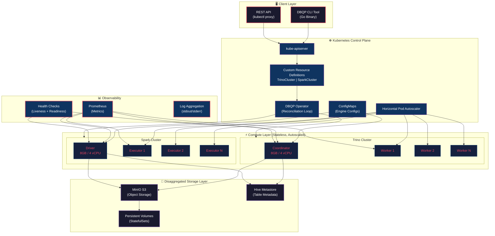
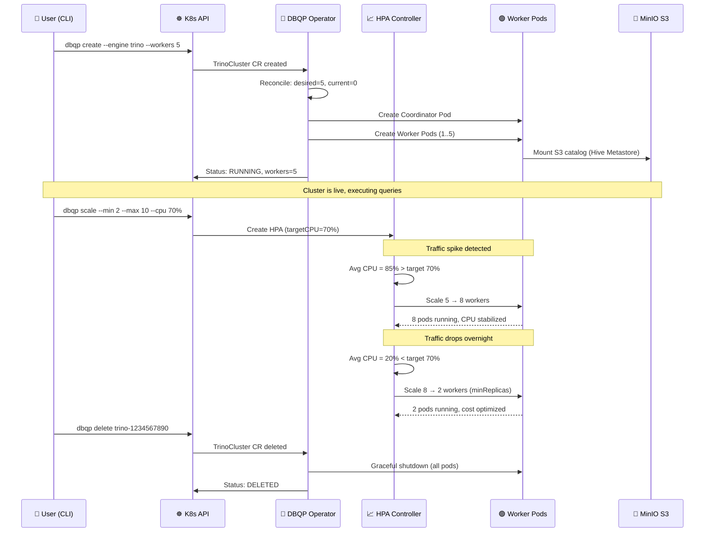
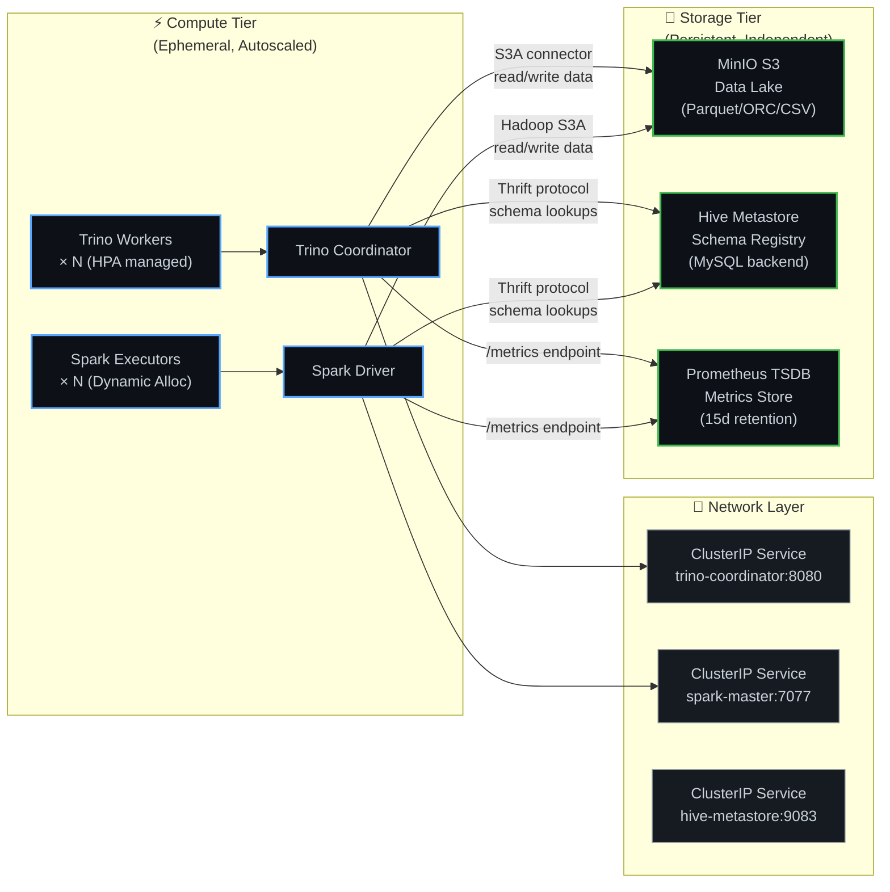
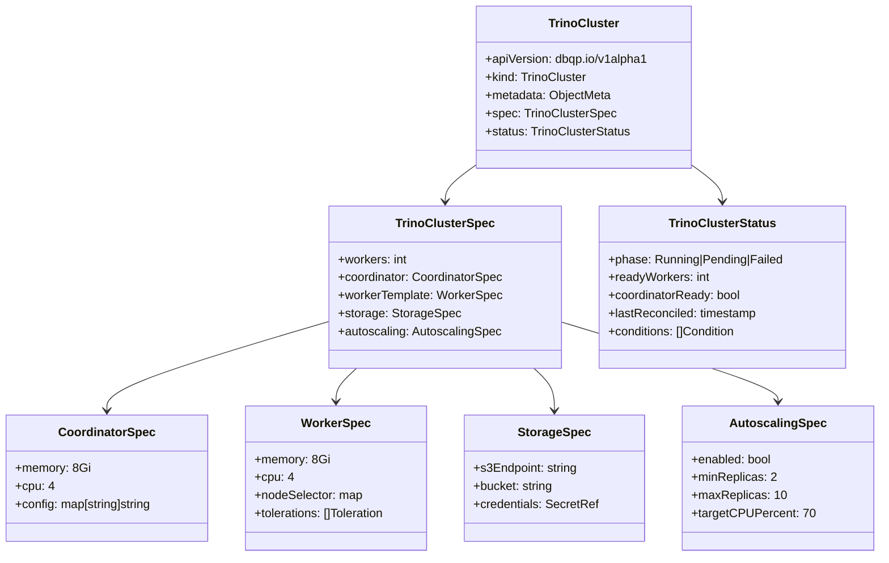

# Distributed Big Data Query Platform (DBQP) on Kubernetes

A production-grade platform for deploying and managing Trino and Spark clusters on Kubernetes with disaggregated compute/storage architecture, custom CRDs, autoscaling, and full CI/CD automation.

---

## System Architecture



---

## Cluster Lifecycle & Autoscaling Flow



---

## Disaggregated Compute/Storage Architecture



---

## CI/CD Pipeline

```mermaid
graph LR
    subgraph TRIGGER["🔀 Trigger"]
        PR["Pull Request"]
        PUSH["Push to main"]
    end

    subgraph BUILD["🔨 Build & Test"]
        GO["Go Build<br/>+ Unit Tests"]
        PY["Python Lint<br/>+ Pytest"]
        DOCKER["Docker Build<br/>(Multi-stage)"]
    end

    subgraph SECURITY["🔒 Security Scan"]
        TRIVY["Trivy<br/>(Container CVEs)"]
        GOSEC["GoSec<br/>(Static Analysis)"]
    end

    subgraph VALIDATE["✅ Integration"]
        KIND["Kind Cluster<br/>(Ephemeral)"]
        CRD_T["Apply CRDs"]
        E2E["E2E Tests<br/>(Create/Scale/Delete)"]
    end

    subgraph DEPLOY["🚀 Deploy"]
        GHCR["Push to GHCR"]
        RELEASE["GitHub Release<br/>+ Changelog"]
    end

    PR --> GO & PY
    PUSH --> GO & PY
    GO --> DOCKER
    PY --> DOCKER
    DOCKER --> TRIVY & GOSEC
    TRIVY --> KIND
    GOSEC --> KIND
    KIND --> CRD_T --> E2E
    E2E --> GHCR --> RELEASE

    classDef trigger fill:#1f2937,stroke:#f59e0b,color:#fbbf24,stroke-width:2px
    classDef build fill:#1f2937,stroke:#3b82f6,color:#93c5fd,stroke-width:2px
    classDef security fill:#1f2937,stroke:#ef4444,color:#fca5a5,stroke-width:2px
    classDef validate fill:#1f2937,stroke:#8b5cf6,color:#c4b5fd,stroke-width:2px
    classDef deploy fill:#1f2937,stroke:#10b981,color:#6ee7b7,stroke-width:2px

    class PR,PUSH trigger
    class GO,PY,DOCKER build
    class TRIVY,GOSEC security
    class KIND,CRD_T,E2E validate
    class GHCR,RELEASE deploy
```



---

## CRD Schema: TrinoCluster



---

## Performance Benchmarks (TPC-H Scale 10)

```mermaid
xychart-beta
    title "Query Latency: Trino vs Spark (seconds, lower is better)"
    x-axis ["Q1", "Q3", "Q5", "Q6", "Q10", "Q12", "Q14", "Q19", "Q22"]
    y-axis "Latency (seconds)" 0 --> 8
    bar [4.2, 2.8, 3.5, 1.2, 3.8, 2.9, 1.8, 4.1, 1.9]
    bar [6.1, 4.5, 5.2, 2.1, 5.7, 4.3, 3.0, 5.9, 3.1]
```



| Query | Trino (s) | Spark (s) | Speedup |
|-------|-----------|-----------|---------|
| Q1 (Pricing Summary) | 4.2 | 6.1 | 1.45× |
| Q3 (Shipping Priority) | 2.8 | 4.5 | 1.61× |
| Q5 (Local Supplier Volume) | 3.5 | 5.2 | 1.49× |
| Q6 (Forecasting Revenue) | 1.2 | 2.1 | 1.75× |
| Q10 (Returned Items) | 3.8 | 5.7 | 1.50× |
| Q12 (Shipping Modes) | 2.9 | 4.3 | 1.48× |
| Q14 (Promotion Effect) | 1.8 | 3.0 | 1.67× |
| Q19 (Discounted Revenue) | 4.1 | 5.9 | 1.44× |
| Q22 (Global Sales Opp.) | 1.9 | 3.1 | 1.63× |

**Cluster Config:** 5 workers, 8GB RAM / 4 vCPU each, MinIO S3 storage, Hive Metastore

---

## Features

### Core Components

**Golang CLI Tool** — Interactive command-line interface for creating, scaling, deleting, and monitoring clusters. Runs TPC-H/TPC-DS benchmarks, streams logs, and integrates directly with the Kubernetes API.

**Kubernetes Operator** — Custom controller that watches TrinoCluster and SparkCluster CRDs, manages pod lifecycle, configures HPA for autoscaling, and handles rolling upgrades with health checks.

**Disaggregated Architecture** — Compute nodes (Trino/Spark workers) scale independently from the persistent storage layer (MinIO S3 + Hive Metastore). Compute is ephemeral and autoscaled; storage is durable and shared.

**Python Benchmarking Suite** — TPC-H and TPC-DS query execution with metrics collection, results export (JSON/CSV), and matplotlib visualization.

**CI/CD Pipeline (GitHub Actions)** — Go/Python testing and linting, Docker multi-stage builds, Trivy and GoSec security scanning, Kind cluster integration tests, and automated releases.

---

## Quick Start

### Prerequisites

- Kubernetes cluster (v1.24+) or Kind for local development
- `kubectl` configured
- Docker (for building images)
- Go 1.21+ and Python 3.9+

### Installation

```bash
# Clone and build
git clone https://github.com/JayDS22/Distributed-Big-Data-Query-Platform-on-Kubernetes.git
cd Distributed-Big-Data-Query-Platform-on-Kubernetes
go build -o dbqp .

# Setup local cluster with Kind
./setup-cluster.sh kind default

# Verify health
./health-check.sh default
```

### Usage

```bash
# Create a 5-worker Trino cluster
./dbqp create --engine trino --workers 5 --memory 8Gi --cpu 4

# Enable autoscaling (scale between 2-10 workers based on CPU)
./dbqp scale --name trino-1234567890 --min 2 --max 10 --cpu-percent 70

# Run TPC-H benchmark
./dbqp benchmark --engine trino --query tpch-q1 --scale 10 --iterations 3 --output json

# Monitor cluster
./dbqp status trino-1234567890
./dbqp logs trino-1234567890 --tail 100 --follow

# Cleanup
./dbqp delete trino-1234567890
```

### Helm Deployment

```bash
# Deploy Trino with Helm
helm install my-trino k8s/helm/trino \
  --set workers=3 \
  --set memory=8Gi \
  --set storageBucket=s3://data

# Or manual deployment
kubectl apply -f crd.yaml
kubectl apply -f trino-deployment.yaml
```

---

## Project Structure

```
dbqp/
├── main.go                   # CLI entrypoint
├── create.go                 # Cluster creation logic
├── scale.go                  # HPA configuration
├── delete.go                 # Graceful cluster teardown
├── status.go                 # Cluster health reporting
├── benchmark.go              # TPC-H/TPC-DS runner
├── logs.go                   # Log streaming
├── config.go                 # Cluster configuration
├── crd.yaml                  # TrinoCluster + SparkCluster CRDs
├── trino-deployment.yaml     # Coordinator + Worker manifests
├── benchmark_runner.py       # Python benchmarking suite
├── setup-cluster.sh          # Kind cluster provisioning
├── health-check.sh           # Diagnostic health checks
├── cleanup.sh                # Environment teardown
├── cicd.yml                  # GitHub Actions workflow
├── Dockerfile                # Multi-stage container build
└── go.mod                    # Go module dependencies
```

---

## Performance Tuning

**Memory** — Set `query.max-memory` in Trino config and adjust heap sizes per engine. Monitor utilization via `kubectl top pods`.

**CPU** — Configure task parallelism and worker thread count. Resource limits in CRD spec prevent noisy-neighbor issues.

**Storage** — Enable S3 caching, use 64MB block sizes, and apply Snappy compression for scan-heavy workloads.

**Autoscaling** — HPA targets 70% CPU utilization by default. Set `minReplicas` based on baseline traffic to avoid cold-start latency during scale-up events.

---

## Roadmap

- Web UI Dashboard (React)
- Query result caching layer
- Cost optimization recommendations
- Multi-cloud deployment (AWS EKS / GCP GKE)
- Query federation across Trino + Spark clusters
- ML-based query optimization

---

## License

MIT License — see LICENSE file
